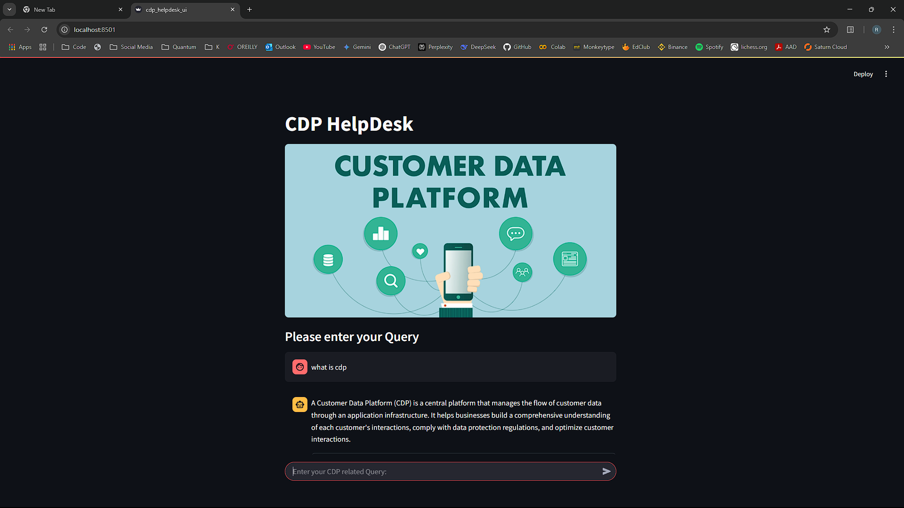
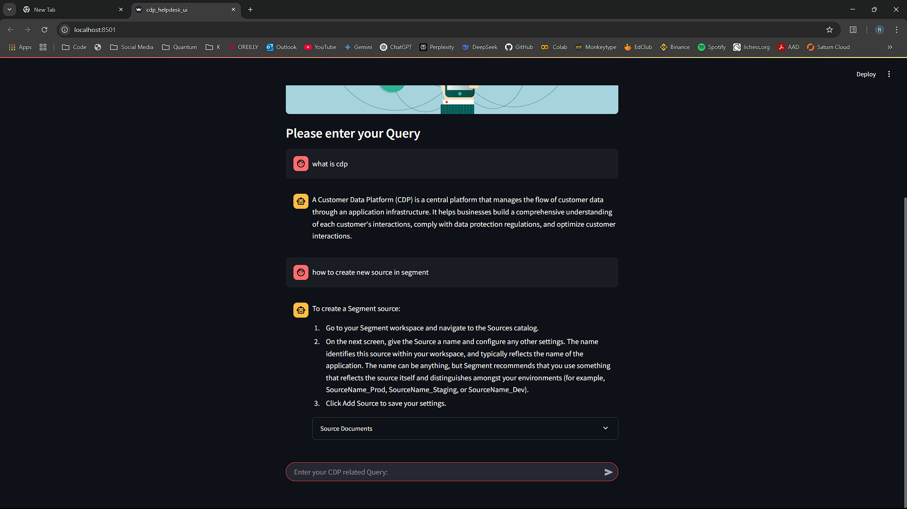
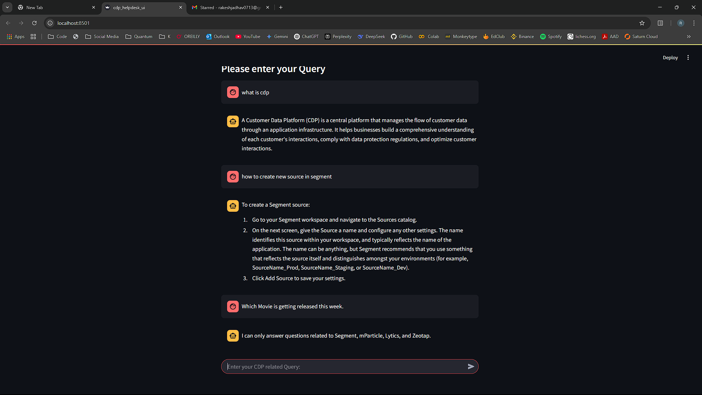
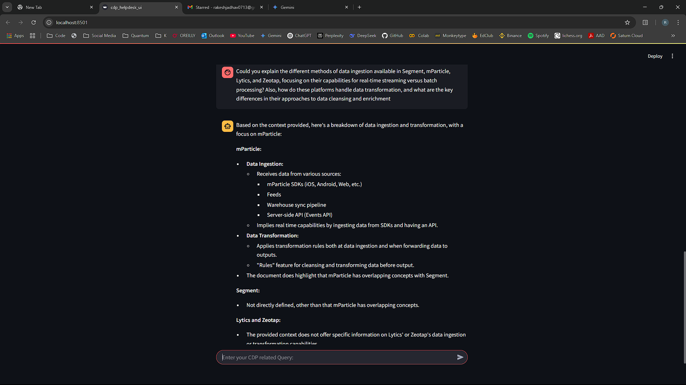

# CDP HelpDesk

## Overview
CDP HelpDesk is a chatbot designed to assist users with questions related to four Customer Data Platforms (CDPs): **Segment, mParticle, Lytics, and Zeotap**. It retrieves relevant information from documentation and provides concise answers using **LangChain**, **FAISS**, and **Google Gemini AI**.

## Features
- **Conversational Retrieval**: Uses FAISS for efficient document search.
- **Google Gemini AI**: Powers both embeddings and the chatbot responses.
- **CDP Relevance Filtering**: Determines if a query is related to Segment, mParticle, Lytics, or Zeotap.
- **Web UI with Streamlit**: Interactive interface for user-friendly query submission.
- **Comparison Capability**: Can compare features of different CDPs based on documentation.

## Setup
### Prerequisites
- Python 3.10+
- Required libraries: `langchain`, `langchain-google-genai`, `langchain-community`, `streamlit`, `python-dotenv`, `faiss-cpu`
- Google Gemini API key

### Installation
1. Clone the repository:
   ```sh
   git clone <repository-url>
   cd <repository-directory>
   ```
2. Install dependencies:
   ```sh
   pip install -r requirements.txt
   ```
3. Set up environment variables:
   - Create a `.env` file and add your Google API key:
     ```sh
     GEMINI_API_KEY=your_google_api_key
     ```
4. Prepare the document database:
   - Ensure all CDP documentation is available in `Data/` directory.
   - Run the indexing script (only required once or after updating data):
     ```sh
     python main.py # Uncomment upload_html() before running
     ```

## Running the Chatbot
### Web Interface (Streamlit)
Run the Streamlit app:
```sh
streamlit run main.py
```
This launches an interactive web UI for querying the chatbot.

### Command-Line Interface (CLI)
Run the chatbot in CLI mode:
```sh
python main.py
```
Type queries related to the supported CDPs. Type `exit` to quit.

## Project Structure
```
.
├── Data/                   # CDP documentation (Lytics, Segment, mParticle, Zeotap)
├── Images/                 # UI assets
├── faiss_index/            # Vector database storage
├── .env                    # API keys and environment variables
├── main.py                 # Main chatbot logic
├── requirements.txt        # Dependencies
└── README.md               # Project documentation
```

## Screenshots
Here are some images showcasing the chatbot's functionality:

1. **Starting UI**
   

2. **Handling CDP Queries**
   

3. **Rejecting Irrelevant Questions**
   

4. **Handling Lengthy Queries**
   

## How It Works
1. **Document Ingestion**: Loads and splits CDP documentation into chunks.
2. **Embedding Creation**: Uses Google Gemini AI to create vector embeddings.
3. **Indexing with FAISS**: Stores embeddings for fast retrieval.
4. **Query Handling**:
   - Determines if the question is CDP-related.
   - Searches the FAISS index for relevant content.
   - Uses Gemini AI to generate a response based on retrieved documents.

## Future Improvements
- Expand CDP coverage.
- Improve retrieval accuracy with hybrid search.
- Add authentication and role-based access.

## License
This project is open-source and available under the MIT License.

